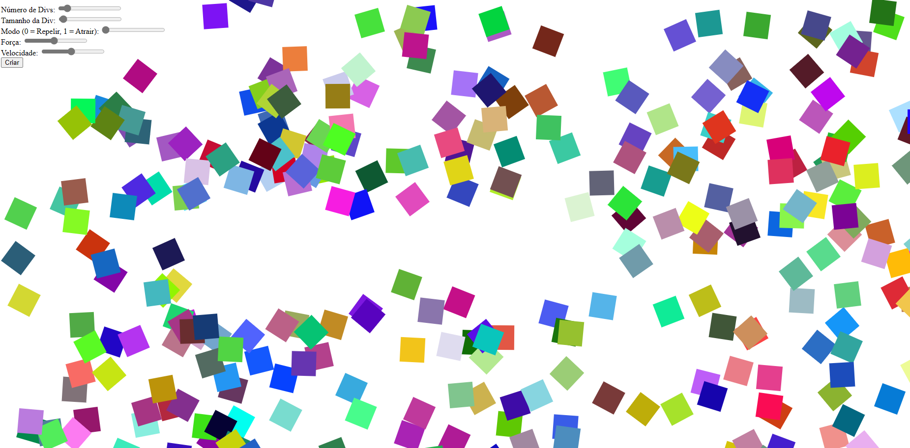

# Manipulador de Divs

Este projeto é uma aplicação web que permite aos usuários criar e manipular elementos div na página.

## Funcionalidades

- **Número de Divs**: Permite ao usuário definir o número de divs que serão criadas na página.
- **Tamanho da Div**: Permite ao usuário definir o tamanho das divs que serão criadas.
- **Modo**: Permite ao usuário escolher entre dois modos - Repelir (0) e Atrair (1).
- **Força**: Permite ao usuário definir a força com que as divs são repelidas ou atraídas.
- **Velocidade**: Permite ao usuário definir a velocidade com que as divs são repelidas ou atraídas.

## Como usar

1. Abra o arquivo `test.html` em seu navegador.
2. Use os controles deslizantes para definir suas preferências.
3. Clique no botão "Criar" para criar as divs.
4. Mova o cursor do mouse pela tela para ver as divs sendo repelidas ou atraídas.

## Tecnologias utilizadas

- HTML
- CSS
- JavaScript
